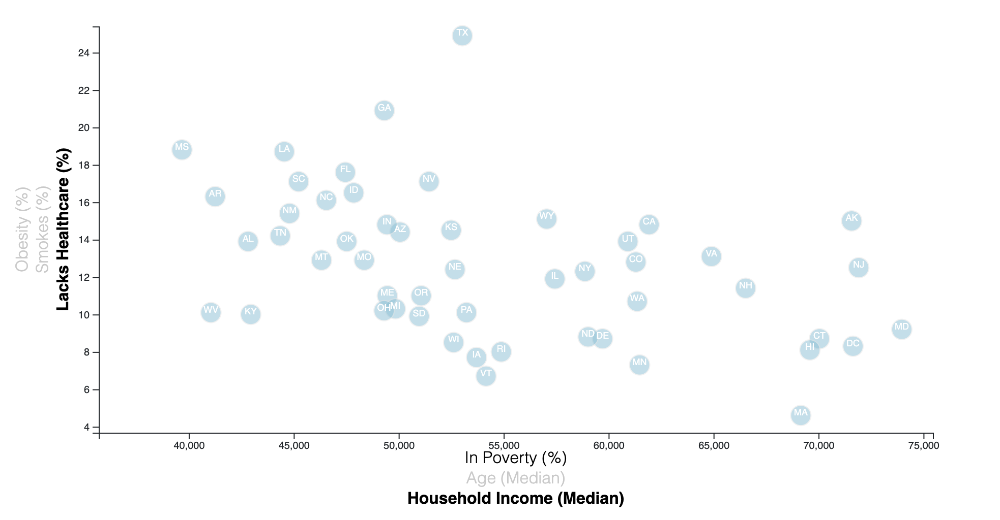

# Data Journalism and D3
## Background
Use D3.js to Build a Static Scatter Plot that Displays Data Based on Users' Choice. 

The [data set](assets/data/data.csv) is based on [2014 ACS 1-year estimates](https://factfinder.census.gov/faces/nav/jsf/pages/searchresults.xhtml) including data on rates of income, obesity, poverty, etc. by state. MOE stands for "margin of error."
## Objectives
1. Create a scatter plot including all demographics and all risk factors. Place additional labels in the scatter plot and give them click events so that users can decide which data to display. Animate the transitions for circles' locations as well as the range of axes. 
2. Add tooltips to circles and display each tooltip with the data that the user has selected. Use the `d3-tip.js` plugin developed by [Justin Palmer](https://github.com/caged/d3-tip).
## Preview

